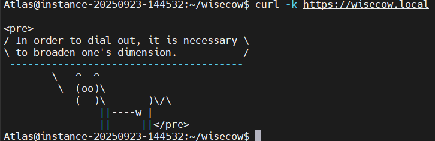

# Minikube & Wisecow App Setup Guide

This guide explains how to set up Minikube in a VM, deploy the Wisecow app with Ingress and TLS, access it from a Windows or Linux laptop, and set up ArgoCD for continuous deployment.

---

## 1. Install Minikube in the VM

```bash
curl -LO https://storage.googleapis.com/minikube/releases/latest/minikube-linux-amd64
sudo install minikube-linux-amd64 /usr/local/bin/minikube
minikube start 
```

---

## 2. Enable NGINX Ingress

```bash
minikube addons enable ingress
```

---

## 3. Deploy Wisecow Manifests

Apply all manifests in order:

```bash
kubectl apply -f k8s/cert-manager.yaml
kubectl apply -f k8s/cluster-issuer.yaml
kubectl apply -f k8s/certificate.yaml
kubectl apply -f k8s/dep.yaml
kubectl apply -f k8s/svc.yaml
kubectl apply -f k8s/ingress.yaml
kubectl apply -f k8s/kube-armor-policy.yaml
```

---

## 4. Get VM IP Address

Find your VM's IP address:

```bash
ip addr | grep inet
```

```bash
minikube tunnel
```

---

## 5. Update Hosts File on Client Machine

### **Windows:**
On your Windows laptop, open `C:\Windows\System32\drivers\etc\hosts` as Administrator and add:
```
<VM_IP> wisecow.local
```
Example:
```
192.168.1.100 wisecow.local
```

### **Linux:**
On your Linux laptop, edit `/etc/hosts` with sudo:
```bash
echo "<VM_IP> wisecow.local" | sudo tee -a /etc/hosts
```
Example:
```bash
echo "192.168.1.100 wisecow.local" | sudo tee -a /etc/hosts
```

---

## 6. Ensure VM Firewall Allows Traffic

Allow inbound traffic on ports 80 (HTTP) and 443 (HTTPS) in your VM's firewall.

---

## 7. Access Wisecow App from Client Machine

Open your browser and go to:

```
https://wisecow.local
```

You may see a certificate warning (self-signed cert); this is expected for local development.



---

## 8. (Optional) Open in Host's Default Browser from VM

From the VM, you can use:

```bash
"$BROWSER" https://wisecow.local
```

---

## 9. Set Up ArgoCD for Continuous Deployment in the VM

ArgoCD automates and manages continuous deployment for your Kubernetes resources **inside your VM's Kubernetes cluster**.

### **Install ArgoCD in the VM:**
```bash
kubectl create namespace argocd
kubectl apply -n argocd -f https://raw.githubusercontent.com/argoproj/argo-cd/stable/manifests/install.yaml
```

### **Expose ArgoCD Server on VM's IP:**
Change the ArgoCD server service to NodePort:
```bash
kubectl -n argocd patch svc argocd-server -p '{"spec": {"type": "NodePort"}}'
kubectl -n argocd get svc argocd-server
```
Note the `NodePort` (e.g., `32080`).  
Access ArgoCD from your laptop:
```
https://<VM_IP>:<NodePort>
```
Example:
```
https://192.168.1.100:32080
```

### **Login to ArgoCD:**
Default username is `admin`.  
Get the initial password:
```bash
kubectl -n argocd get secret argocd-initial-admin-secret -o jsonpath="{.data.password}" | base64 -d
```

### **Connect Your Wisecow Git Repository:**
- In the ArgoCD UI, create a new application.
- Set your repo URL and the path to your manifests (e.g., `/k8s`).
- Set the destination cluster and namespace (your VM's cluster).

Now, any changes pushed to your repo will be automatically deployed by ArgoCD **inside your VM's Kubernetes cluster**.

---

## Notes

- All manifests are in the `k8s/` directory.
- TLS is managed by cert-manager.
- Ingress is handled by NGINX.
- KubeArmor enforces zero trust policy for the wisecow pod.
- ArgoCD provides automated continuous deployment for your cluster running in the VM.

---