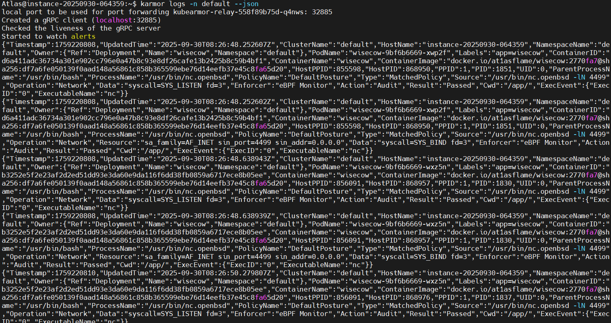

# KubeArmor Setup and Zero-Trust Enforcement on Kubernetes

This repository demonstrates the installation and usage of **KubeArmor** for enforcing **zero-trust security policies** in a Kubernetes cluster.



---

## Prerequisites

* A running Kubernetes cluster (tested with **k3s** or any managed cluster)
* `kubectl` installed and configured
* `helm` installed
* Optional: `sudo` privileges for installing `karmor` CLI in `/usr/local/bin`

---

## 1. Install KubeArmor Operator via Helm

Add the official KubeArmor Helm repository and update:

```bash
helm repo add kubearmor https://kubearmor.github.io/charts
helm repo update
```

Install or upgrade the KubeArmor operator:

```bash
helm upgrade --install kubearmor-operator kubearmor/kubearmor-operator \
  -n kubearmor --create-namespace
```

Apply the sample configuration:

```bash
kubectl apply -f https://raw.githubusercontent.com/kubearmor/KubeArmor/main/pkg/KubeArmorOperator/config/samples/sample-config.yml
```


---

## 2. Install KubeArmor CLI

Install `karmor` CLI using the official script:

```bash
curl -sfL http://get.kubearmor.io/ | sudo sh -s -- -b /usr/local/bin
```

> If you do not have `sudo` privileges, install it in a directory in your `PATH`.

Verify installation:

```bash
karmor version
```

---

## 3. Enable File Posture Enforcement on Default Namespace

Annotate the `default` namespace to block unauthorized file access:

```bash
kubectl annotate ns default kubearmor-file-posture=block --overwrite
```

---

## 4. Monitor Security Logs

Use `karmor` to view KubeArmor logs in JSON format:

```bash
karmor logs -n default --json
```


> The above image shows a sample **policy violation** captured by KubeArmor in JSON format. It demonstrates how unauthorized actions are blocked according to the zero-trust policy, including the process, file, or network event that triggered the violation.

---

## 5. References

* [KubeArmor Official Documentation](https://kubearmor.com/docs/)
* [KubeArmor GitHub](https://github.com/kubearmor/KubeArmor)

---

This README provides a **step-by-step guide** to get KubeArmor running and enforce zero-trust security on your Kubernetes workloads.
